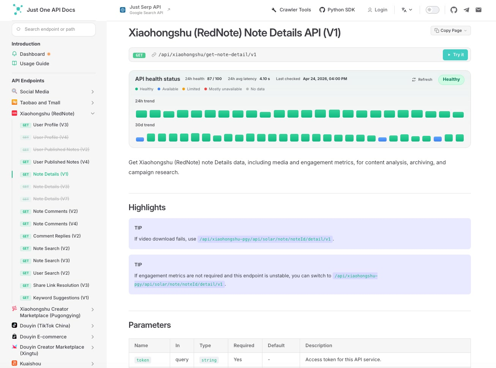

<p align="center">
  <a href="https://justoneapi.com/en?utm_source=github.com&utm_medium=referral&utm_campaign=justoneapi_justoneapi_python&utm_content=repo_readme_logo">
    
  </a>
</p>


[English](README.md) | [简体中文](README.zh-CN.md)

# Just One API - Python SDK

Official Python SDK for accessing [Just One API](https://justoneapi.com/en?utm_source=github.com&utm_medium=referral&utm_campaign=justoneapi_justoneapi_python&utm_content=repo_readme) - a unified data service platform that provides structured data from social media, e-commerce, and content platforms.

Supported platforms include Taobao & Tmall, Xiaohongshu, Xiaohongshu Pugongying, Douyin, Douyin Xingtu, Kuaishou, Weibo, Bilibili, JD, WeChat, Douban, TikTok, TikTok Shop, Youku, Instagram, YouTube, Reddit, Toutiao, Zhihu, Amazon, Facebook, X (Twitter), Beike, IMDb, and more. To explore the full API catalog, visit the [official website](https://justoneapi.com/en?utm_source=github.com&utm_medium=referral&utm_campaign=justoneapi_justoneapi_python&utm_content=repo_readme).

## Platform Overview

The documentation center helps you browse endpoint health, versioned API paths, request parameters, and platform-specific usage notes.



The console provides API token management, balance visibility, request logs, usage trends, and spending analytics.


## Installation

```bash
pip install justoneapi
```

## Quick Start

```python
from justoneapi import JustOneAPIClient

client = JustOneAPIClient(token="your_token")

# Example: Douyin video search
response = client.douyin.search_video_v4(keyword="deepseek")

print(response.success)  # True only when code == 0
print(response.code)     # Business code returned by the API
print(response.message)  # Server message
print(response.data)     # Actual payload
```

## Response Shape

Every API method returns an `ApiResponse` instance with these fields:

| Field | Type | Description |
| --- | --- | --- |
| `success` | `bool` | `True` only when `code == 0`. |
| `code` | `Any` | Raw business code returned by the API. |
| `message` | `str` | Server message. |
| `data` | `Any` | Response payload from the API. |
| `raw_json` | `dict` | Full response payload before SDK normalization. |

## Error Handling

By default, business failures do not raise exceptions. You can check `response.success`, `response.code`, and `response.message`.

If you prefer exceptions for non-zero business codes:

```python
from justoneapi import JustOneAPIClient, BusinessError

client = JustOneAPIClient(
    token="your_token",
    raise_on_business_error=True,
)

try:
    response = client.douyin.search_video_v4(keyword="deepseek")
except BusinessError as exc:
    print(exc.response.code)
    print(exc.response.message)
```

## Authentication

All API requests require a valid API token.

Register here:

- [Get API Token](https://dashboard.justoneapi.com/en/login?utm_source=github.com&utm_medium=referral&utm_campaign=justoneapi_justoneapi_python&utm_content=repo_readme)

## Documentation

Full API documentation:

- [API Documentation](https://docs.justoneapi.com/en?utm_source=github.com&utm_medium=referral&utm_campaign=justoneapi_justoneapi_python&utm_content=repo_readme)

The documentation includes:

- Request parameters
- Response fields
- Error codes
- Platform-specific examples

## Official Website

- [Home Page](https://justoneapi.com/en?utm_source=github.com&utm_medium=referral&utm_campaign=justoneapi_justoneapi_python&utm_content=repo_readme)

## Contact

If you have questions, feedback, or partnership inquiries:

- [Contact Us](https://justoneapi.com/en/contact?utm_source=github.com&utm_medium=referral&utm_campaign=justoneapi_justoneapi_python&utm_content=repo_readme)

## License

This project is licensed under the MIT License.
