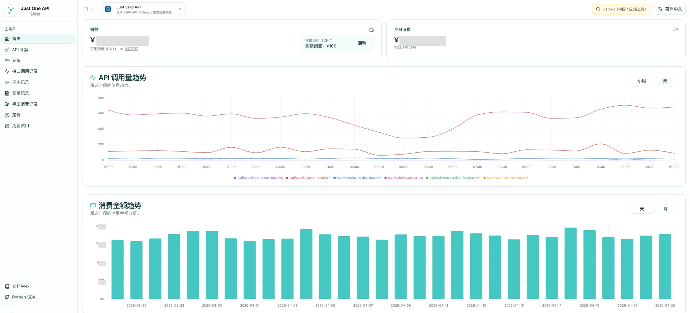

[English](README.md) | [简体中文](README.zh-CN.md)

# Just One API - Python SDK

官方 Python SDK，用于访问 [Just One API](https://justoneapi.com/zh/?utm_source=github.com&utm_medium=referral&utm_campaign=justoneapi_justoneapi_python&utm_content=repo_readme)。

Just One API 是一个统一的数据服务平台，提供来自社交媒体、电商和内容平台的结构化数据。

支持的平台包括淘宝、天猫、小红书、小红书蒲公英、抖音、抖音星图、快手、微博、哔哩哔哩、京东、微信、豆瓣、TikTok、TikTok Shop、优酷、Instagram、YouTube、Reddit、头条、知乎、亚马逊、Facebook、X(Twitter)、贝壳、IMDb 等接口。想了解更多，可以访问[官网](https://justoneapi.com/zh/?utm_source=github.com&utm_medium=referral&utm_campaign=justoneapi_justoneapi_python&utm_content=repo_readme)。

## 系统概览

文档中心支持查看接口健康状态、版本化 API 路径、请求参数以及各平台的使用提示。


控制台提供 API 令牌管理、余额展示、接口调用记录、调用量趋势和消费金额分析。



## 安装

```bash
pip install justoneapi
```

## 快速开始

```python
from justoneapi import JustOneAPIClient

client = JustOneAPIClient(token="your_token")

# 示例：搜索抖音视频
response = client.douyin.search_video_v4(keyword="deepseek")

print(response.success)  # 仅当 code == 0 时为 True
print(response.code)     # 服务端返回的业务码
print(response.message)  # 服务端消息
print(response.data)     # 实际业务数据
```

## 返回结构

每个 API 方法都会返回一个 `ApiResponse` 对象，包含以下字段：

| 字段 | 类型 | 说明 |
| --- | --- | --- |
| `success` | `bool` | 仅当 `code == 0` 时为 `True`。 |
| `code` | `Any` | 服务端返回的业务码。 |
| `message` | `str` | 服务端消息。 |
| `data` | `Any` | API 返回的业务数据。 |
| `raw_json` | `dict` | SDK 处理前的完整 JSON 响应。 |

## 错误处理

默认情况下，业务失败不会抛异常，你可以通过 `response.success`、`response.code` 和 `response.message` 自行判断。

如果你希望业务失败时直接抛异常：

```python
from justoneapi import JustOneAPIClient, BusinessError

client = JustOneAPIClient(
    token="your_token",
    raise_on_business_error=True,
)

try:
    response = client.douyin.search_video_v4(keyword="deepseek")
except BusinessError as exc:
    print(exc.response.code)
    print(exc.response.message)
```

## 身份认证

所有 API 请求都需要有效的 API Token。

注册链接：

- [注册获取 Token](https://dashboard.justoneapi.com/zh/login?utm_source=github.com&utm_medium=referral&utm_campaign=justoneapi_justoneapi_python&utm_content=repo_readme)

## 文档中心

完整接口文档：

- [API 文档](https://docs.justoneapi.com/zh/?utm_source=github.com&utm_medium=referral&utm_campaign=justoneapi_justoneapi_python&utm_content=repo_readme)

文档中包含：

- 请求参数说明
- 返回字段说明
- 错误码说明
- 各平台调用示例

## 官方网站

- [官方网站](https://justoneapi.com/zh/?utm_source=github.com&utm_medium=referral&utm_campaign=justoneapi_justoneapi_python&utm_content=repo_readme)

## 联系我们

如果你有任何问题、反馈或合作需求：

- [联系我们](https://justoneapi.com/zh/contact?utm_source=github.com&utm_medium=referral&utm_campaign=justoneapi_justoneapi_python&utm_content=repo_readme)

## 许可证

本项目基于 MIT License 发布。
